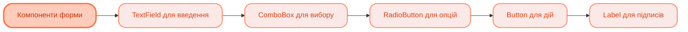

<sup>📒 Readme ver 1.0 08.11.2025 02:40<sup/>


# `Лабораторна робота` `№6` `Розробка GUI з JavaFX`

[](https://docs.google.com/document/d/19unIe4WaBjPMkZOxbllCGPG0m37LRf8r/edit?usp=drive_link&ouid=110536394177911584125&rtpof=true&sd=true)
[](https://github.com/Soluvent)


[](https://github.com/Soluvent/DuoCalculator-Sixth/edit/main/README.md)

## `📝 Завдання `
### Калькулятор з графічним інтерфейсом
  - [x] Реалізувати інженерний калькулятор з використанням JavaFX
  - [x] Створити калькулятор програміста з додатковим аркушем "Автолізинг"
  - [x] Використати менеджери компонування (GridPane, HBox, VBox)
  - [x] Застосувати стилізацію через CSS
  - [x] Реалізувати систему меню з перемиканням режимів
  - [x] Додати радіокнопки для вибору режимів обчислення

## `🧠 Mindmap `




## `🛠️ Реалізація коду `

## Інженерний калькулятор (EngineerCalc.java)

### **Головний клас та структура**
> [!NOTE]
> Клас успадковується від `Application` - базового класу всіх JavaFX додатків. Метод `start()` є точкою входу для графічного інтерфейсу. Створюється `VBox` як кореневий контейнер з сірим фоном.

<h4 align="wide">

```java
public class EngineerCalc extends Application {

    @Override
    public void start(Stage primaryStage) throws Exception {
        VBox root = new VBox(5);
        root.setStyle("-fx-background-color: #EDF0F2");
        Scene scene = new Scene(root);

        root.getChildren().add(configureMenu());

        HBox box = configureResultView();
        root.getChildren().add(box);
        VBox.setMargin(box, new Insets(10, 10, 5, 10));

        HBox radioBox = configureRadioButtons();
        root.getChildren().add(radioBox);
        VBox.setMargin(radioBox, new Insets(5, 10, 5, 10));

        root.getChildren().add(configureButtons());

        primaryStage.setTitle("Инженерный калькулятор");
        primaryStage.setResizable(false);
        primaryStage.setScene(scene);
        primaryStage.show();
    }
}
```

### **Внутрішній клас MyButton**
> [!NOTE]
> Власний клас кнопки для уніфікації стилю. Встановлює максимальний розмір кнопки, що дозволяє їй розтягуватися на весь доступний простір у GridPane.

<h4 align="wide">

```java
private class MyButton extends Button {
    MyButton(String text) {
        super(text);
        this.setMaxSize(Double.MAX_VALUE, Double.MAX_VALUE);
    }
}
```

### **Конфігурація меню**
> [!NOTE]
> Створення `MenuBar` з трьома пунктами меню. Для режимів калькулятора використовуються `RadioMenuItem` об'єднані в `ToggleGroup`, що дозволяє вибрати лише один режим.

<h4 align="wide">

```java
private MenuBar configureMenu() {
    MenuBar bar = new MenuBar();

    Menu view = new Menu("_Вид");
    ToggleGroup viewGroup = new ToggleGroup();

    RadioMenuItem standard = new RadioMenuItem("Обычный");
    standard.setToggleGroup(viewGroup);

    RadioMenuItem engineer = new RadioMenuItem("Инженерный");
    engineer.setToggleGroup(viewGroup);
    engineer.setSelected(true);

    RadioMenuItem programmer = new RadioMenuItem("Программист");
    programmer.setToggleGroup(viewGroup);

    view.getItems().addAll(standard, engineer, programmer, new SeparatorMenuItem());

    Menu edit = new Menu("_Правка");
    Menu help = new Menu("_Справка");

    bar.getMenus().addAll(view, edit, help);
    return bar;
}
```

### **Область відображення результату**
> [!NOTE]
> `HBox` з градієнтним фоном та рамкою для відображення результатів обчислень. Використовує CSS-стилізацію для створення ефекту вгнутості. Текст вирівнюється по правому краю.

<h4 align="wide">

```java
private HBox configureResultView() {
    HBox box = new HBox();
    box.setStyle("-fx-border-style: solid inside;" +
            "-fx-border-width: 1;" +
            "-fx-border-radius: 3;" +
            "-fx-border-color: gray;" +
            "-fx-padding: 25 2 6 30;" +
            "-fx-background-color: linear-gradient(to bottom, #d3eefb 0%,#f4f8f9 59%);");

    Text text = new Text("0");
    text.setTextAlignment(TextAlignment.RIGHT);
    text.setFont(new Font(40));

    box.getChildren().add(text);
    box.setAlignment(Pos.BOTTOM_RIGHT);
    return box;
}
```

### **Радіокнопки вибору режиму кутів**
> [!NOTE]
> Панель з радіокнопками для вибору одиниць вимірювання кутів. `ToggleGroup` забезпечує можливість вибору лише однієї опції. За замовчуванням вибрано "Градуси".

<h4 align="wide">

```java
private HBox configureRadioButtons() {
    HBox radioBox = new HBox(10);
    radioBox.setPadding(new Insets(5, 5, 5, 5));
    radioBox.setAlignment(Pos.CENTER_LEFT);

    ToggleGroup group = new ToggleGroup();

    RadioButton radGradusy = new RadioButton("Градусы");
    radGradusy.setToggleGroup(group);
    radGradusy.setSelected(true);

    RadioButton radRadiany = new RadioButton("Радианы");
    radRadiany.setToggleGroup(group);

    RadioButton radGrady = new RadioButton("Грады");
    radGrady.setToggleGroup(group);

    radioBox.getChildren().addAll(radGradusy, radRadiany, radGrady);
    return radioBox;
}
```

### **Сітка кнопок калькулятора**
> [!NOTE]
> `GridPane` з 10 колонками та 6 рядками для розміщення кнопок калькулятора. `ColumnConstraints` забезпечує рівномірний розподіл ширини. Використовується метод `add()` з параметрами для об'єднання комірок (colspan, rowspan).

<h4 align="wide">

```java
private GridPane configureButtons() {
    GridPane pane = new GridPane();
    pane.setStyle("-fx-padding: 2 10 4 10");
    pane.setHgap(6);
    pane.setVgap(6);

    ColumnConstraints cc = new ColumnConstraints();
    cc.setFillWidth(true);
    cc.setHgrow(Priority.ALWAYS);
    pane.getColumnConstraints().addAll(cc, cc, cc, cc, cc, cc, cc, cc, cc, cc);

    RowConstraints rc = new RowConstraints();
    rc.setFillHeight(true);
    rc.setVgrow(Priority.ALWAYS);
    pane.getRowConstraints().addAll(rc, rc, rc, rc, rc, rc);

    // Рядок 1: Кнопки пам'яті
    pane.add(new MyButton("MC"), 5, 0);
    pane.add(new MyButton("MR"), 6, 0);
    pane.add(new MyButton("MS"), 7, 0);
    pane.add(new MyButton("M+"), 8, 0);
    pane.add(new MyButton("M-"), 9, 0);

    // Рядок 2: Функції та основні операції
    pane.add(new MyButton("Inv"), 0, 1);
    pane.add(new MyButton("ln"), 1, 1);
    pane.add(new MyButton("("), 2, 1);
    pane.add(new MyButton(")"), 3, 1);
    pane.add(new MyButton("<-"), 5, 1);
    pane.add(new MyButton("CE"), 6, 1);
    pane.add(new MyButton("C"), 7, 1);
    pane.add(new MyButton("±"), 8, 1);
    pane.add(new MyButton("√"), 9, 1);

    // Рядки 3-5: Тригонометричні функції та цифри
    pane.add(new MyButton("7"), 5, 2);
    pane.add(new MyButton("8"), 6, 2);
    pane.add(new MyButton("9"), 7, 2);
    pane.add(new MyButton("/"), 8, 2);
    
    // Кнопка "=" займає 2 рядки
    pane.add(new MyButton("="), 9, 4, 1, 2);
    
    // Кнопка "0" займає 2 колонки
    pane.add(new MyButton("0"), 5, 5, 2, 1);

    return pane;
}
```

## Калькулятор програміста (ProgrammerCalc.java)

### **Двопанельна структура**
> [!NOTE]
> Використовується `HBox` як кореневий контейнер для розділення на дві панелі: ліву (калькулятор) та праву (аркуш автолізингу). `Separator` створює вертикальну розділову лінію між панелями.

<h4 align="wide">

```java
@Override
public void start(Stage primaryStage) throws Exception {
    HBox root = new HBox();
    root.setStyle("-fx-background-color: #EDF0F2");

    VBox leftPanel = buildProgrammerCalc();
    Separator separator = new Separator(javafx.geometry.Orientation.VERTICAL);
    VBox rightPanel = buildLeasingWorksheet();
    HBox.setMargin(rightPanel, new Insets(10));

    root.getChildren().addAll(leftPanel, separator, rightPanel);
    HBox.setHgrow(rightPanel, Priority.ALWAYS);

    Scene scene = new Scene(root, 930, 510);
    primaryStage.setTitle("Калькулятор");
    primaryStage.setResizable(false);
    primaryStage.setScene(scene);
    primaryStage.show();
}
```

### **Область відображення з бітовим представленням**
> [!NOTE]
> `GridPane` для відображення результату та бітового представлення числа. Результат показується великим шрифтом, а нижче відображаються біти числа у вигляді 4-бітних груп з індексами.

<h4 align="wide">

```java
private Pane buildResultArea() {
    GridPane grid = new GridPane();
    grid.setPadding(new Insets(10));
    grid.setStyle("-fx-border-style: solid inside; -fx-border-width: 1; " +
                 "-fx-border-color: lightgray; -fx-background-color: #F8F8F8;");
    grid.setHgap(10);
    grid.setVgap(5);

    Text mainResult = new Text("0");
    mainResult.setFont(new Font(36));
    grid.add(mainResult, 0, 0, 8, 1);
    GridPane.setHalignment(mainResult, HPos.RIGHT);

    String[] bitValues = {"0000", "0000", "0000", "0000", "0000", "47", "0000", "0000"};
    for (int i = 0; i < bitValues.length; i++) {
        Text t = new Text(bitValues[i]);
        t.setFont(new Font(14));
        grid.add(t, i, 1);
        GridPane.setHalignment(t, HPos.CENTER);
    }

    return grid;
}
```

### **Кнопки калькулятора програміста**
> [!NOTE]
> Складний `GridPane` з радіокнопками для вибору системи числення (Hex, Dec, Oct, Bin) та розміру даних (1-8 байт). Кнопки шістнадцяткових цифр A-F та бітових операцій (AND, OR, XOR, NOT).

<h4 align="wide">

```java
private Pane buildProgrammerButtons() {
    GridPane pane = new GridPane();
    pane.setHgap(6);
    pane.setVgap(6);

    // Налаштування 8 колонок з рівномірним розподілом
    for (int i = 0; i < 8; i++) {
        ColumnConstraints cc = new ColumnConstraints();
        cc.setPercentWidth(12.5);
        cc.setHgrow(Priority.ALWAYS);
        pane.getColumnConstraints().add(cc);
    }

    // Радіокнопки для вибору системи числення
    VBox radioHex = createRadioGroup(true, "Hex", "Dec", "Oct", "Bin");
    pane.add(radioHex, 0, 0, 1, 4);

    // Радіокнопки для вибору розміру даних
    VBox radioBytes = createRadioGroup(true, "8 байт", "4 байта", "2 байта", "1 байт");
    pane.add(radioBytes, 1, 0, 1, 4);

    // Кнопки шістнадцяткових цифр
    pane.add(new MyButton("A"), 3, 0);
    pane.add(new MyButton("B"), 3, 1);
    pane.add(new MyButton("D"), 2, 2);
    pane.add(new MyButton("E"), 2, 3);
    pane.add(new MyButton("F"), 3, 4);

    // Бітові операції
    pane.add(new MyButton("And"), 3, 5);
    pane.add(new MyButton("Or"), 0, 5);
    pane.add(new MyButton("Xor"), 1, 5);
    pane.add(new MyButton("Not"), 2, 5);

    // Кнопка "0" займає 2 комірки
    pane.add(new MyButton("0"), 4, 5, 2, 1);

    return pane;
}
```

### **Форма автолізингу**
> [!NOTE]
> Окрема панель з формою для розрахунку автолізингу. Використовує `ComboBox` для вибору параметра розрахунку, `GridPane` для розміщення полів введення та кнопку для виконання обчислення.

<h4 align="wide">

```java
private VBox buildLeasingWorksheet() {
    VBox sheetRoot = new VBox(10);
    sheetRoot.setPadding(new Insets(10));
    sheetRoot.setStyle("-fx-border-color: lightgray; -fx-border-width: 1; " +
                      "-fx-background-color: #F8F8F8;");
    sheetRoot.setPrefWidth(320);

    Label title = new Label("Выберите значение для вычисления");
    title.setFont(new Font(13));

    ComboBox<String> combo = new ComboBox<>(
        FXCollections.observableArrayList(
            "Регулярный платеж", "Стоимость аренды", "Срок аренды"
        )
    );
    combo.setValue("Регулярный платеж");
    combo.setMaxWidth(Double.MAX_VALUE);

    GridPane formGrid = new GridPane();
    formGrid.setVgap(8);
    formGrid.setHgap(10);

    // Налаштування колонок: ліва 45%, права 55%
    ColumnConstraints col1 = new ColumnConstraints();
    col1.setPercentWidth(45);
    col1.setHalignment(HPos.RIGHT);
    ColumnConstraints col2 = new ColumnConstraints();
    col2.setPercentWidth(55);
    formGrid.getColumnConstraints().addAll(col1, col2);

    // Додавання полів форми
    formGrid.add(new Label("Стоимость аренды:"), 0, 0);
    formGrid.add(new TextField("Ввод значения"), 1, 0);
    formGrid.add(new Label("Срок аренды:"), 0, 1);
    formGrid.add(new TextField("Ввод значения"), 1, 1);
    // ... інші поля

    Button calculateButton = new Button("Вычислить");
    TextField resultField = new TextField();
    resultField.setEditable(false);

    formGrid.add(calculateButton, 0, 5);
    formGrid.add(resultField, 1, 5);

    sheetRoot.getChildren().addAll(title, combo, new Separator(), formGrid);
    return sheetRoot;
}
```

### **Допоміжний метод створення групи радіокнопок**
> [!NOTE]
> Універсальний метод для створення вертикальної групи радіокнопок. Приймає масив рядків та створює `RadioButton` для кожного, об'єднуючи їх у `ToggleGroup`.

<h4 align="wide">

```java
private VBox createRadioGroup(boolean firstSelected, String... items) {
    VBox vbox = new VBox(5);
    vbox.setAlignment(Pos.CENTER_LEFT);
    ToggleGroup group = new ToggleGroup();
    
    for (int i = 0; i < items.length; i++) {
        RadioButton rb = new RadioButton(items[i]);
        rb.setToggleGroup(group);
        if (i == 0 && firstSelected) {
            rb.setSelected(true);
        }
        vbox.getChildren().add(rb);
    }
    return vbox;
}
```

## `🎨 Ключові особливості JavaFX `

### Життєвий цикл додатку
JavaFX додаток має три основні методи життєвого циклу:
- **init()** - викликається при запуску, для ініціалізації (необов'язковий)
- **start(Stage)** - головний метод, створює інтерфейс (обов'язковий)
- **stop()** - викликається при закритті, для очищення (необов'язковий)

### Ієрархія сцени (Scene Graph)
```
Stage (вікно)
  └── Scene (сцена)
       └── Root Node (кореневий вузол)
            ├── MenuBar
            ├── HBox (область результату)
            ├── HBox (радіокнопки)
            └── GridPane (кнопки)
```

### Менеджери компонування
- **GridPane** - сітка з рядками та колонками, підходить для форм та калькулятора
- **VBox** - вертикальне розміщення елементів
- **HBox** - горизонтальне розміщення елементів
- **BorderPane** - п'ять регіонів (top, bottom, left, right, center)

### Стилізація
JavaFX підтримує стилізацію через:
- Inline стилі: `setStyle("-fx-background-color: #EDF0F2")`
- CSS файли для більших проектів
- Програмне встановлення властивостей

### Constraints (обмеження)
- **ColumnConstraints** - контролює поведінку колонок у GridPane
- **RowConstraints** - контролює поведінку рядків у GridPane
- **setHgrow()** / **setVgrow()** - як елемент розтягується при зміні розміру вікна

## `📚 Використані компоненти JavaFX `

| Компонент | Призначення | Особливості |
|-----------|-------------|-------------|
| **Button** | Кнопки інтерфейсу | Підтримка подій onClick |
| **TextField** | Поля введення тексту | Можуть бути редагованими/нередагованими |
| **Label** | Текстові підписи | Статичний текст |
| **Text** | Текст з форматуванням | Підтримка шрифтів та вирівнювання |
| **RadioButton** | Вибір однієї опції | Об'єднуються у ToggleGroup |
| **ComboBox** | Випадаючий список | Вибір зі списку значень |
| **MenuBar** | Меню програми | Містить Menu та MenuItem |
| **Separator** | Розділова лінія | Вертикальна або горизонтальна |

